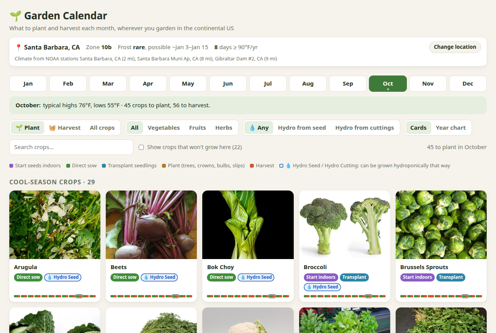

# 🌱 Garden Calendar

**What to plant and harvest each month, wherever you garden in the continental US.**

Pick your location (or let the browser find it) and the calendar works out when to start seeds indoors, direct sow, transplant, plant and harvest 94 fruits, vegetables and herbs, based on your local frost dates and temperatures.

**▶ Try it: [bishopdynamics.github.io/garden-calendar](https://bishopdynamics.github.io/garden-calendar/)**



## Features

- **Location-aware planting windows:** use your browser's location, or search by ZIP code or city. Everything is calculated for that spot: frost dates, hardiness zone, summer heat.
- **Month by month:** see what to plant or harvest this month, with notes like "about 6 weeks until your last frost: start warm-season seeds indoors."
- **Year chart:** every crop's whole year at a glance, with indoor starts, sowing, transplanting, planting and harvest.
- **94 crops:** 50 vegetables, 37 fruits (berries, vines, citrus and fruit trees) and 7 herbs, each with a photo, spacing, sun, days to harvest and growing tips.
- **Advice for your area:** low-chill fruit varieties for mild winters, short-day vs. long-day onions by latitude, short-season varieties where summers are cool, and more.
- **Honest about what won't grow:** crops that can't survive your winters or ripen in your summers are hidden by default (with the reason, if you want to see them). Borderline crops are marked **Marginal**, with tips for making them work.
- **Hydroponics:** every crop is tagged 💧 **Hydro Seed** and/or 💧 **Hydro Cutting** if it can be grown hydroponically that way, with notes on how.
- **Works offline:** no server, no tracking, no API calls. The page never sends your location anywhere; all the calculations happen in your browser. Download the repo and double-click `index.html`.

## How it works

Planting dates aren't stored; they're computed in your browser from climate data:

1. **Your location** is matched to the nearest ZIP code (for its USDA hardiness zone) and the three nearest NOAA weather stations.
2. **Local climate** is blended from those stations: average last/first frost dates and daily temperature curves built from monthly highs and lows.
3. **Each crop has rules** describing what it needs (see [`build/crops.py`](build/crops.py)): soil warmth at planting, frost tolerance, how hot is too hot (bolting, failed fruit set), how much heat it needs to ripen, and its hardiness-zone range for perennials.
4. **The engine** ([`engine.js`](engine.js)) tries every planting date through the year. It grows the crop forward using [growing degree days](https://en.wikipedia.org/wiki/Growing_degree-day), so crops mature faster in warm weather and slower in cool weather. It keeps the dates where the crop survives and matures, and turns them into months.

The model was checked against a hand-made calendar for Claremont, CA and spot-checked against extension-service guidance for Minneapolis, Duluth, Atlanta, Houston, Phoenix and Seattle.

> **A word of caution:** these are estimates from 30-year climate averages at nearby weather stations. Elevation, microclimate and the year's weather can shift things by a few weeks. Your local cooperative extension office is the best tie-breaker.

## Running it locally

There's no build step needed to use it: clone the repo and open `index.html` in a browser. It works from `file://`, fully offline.

## Rebuilding the data

The generated files (`data.js`, `geo/*.js`, `images/`) are committed. To change crops or refresh the datasets, see [`build/README.md`](build/README.md). In short:

```sh
python3 build/build.py        # crops + photos  -> data.js, images/
python3 build/geo.py          # locations + climate -> geo/   (after downloading the raw datasets)
node build/test/check.js      # compare against the Claremont reference + sample cities
node build/test/sweep.js 400  # anomaly sweep across 400 ZIP codes
```

Requires Python 3 with ImageMagick (`convert`) for photos, and Node.js for the tests.

## Deployment

Every push to `main` publishes the site with GitHub Actions ([`.github/workflows/pages.yml`](.github/workflows/pages.yml)). A matching GitLab Pages job lives in [`.gitlab-ci.yml`](.gitlab-ci.yml).

## Data sources & credits

- **Climate:** [NOAA NCEI U.S. Climate Normals, 1991–2020](https://www.ncei.noaa.gov/products/land-based-station/us-climate-normals): frost-date probabilities and monthly temperature normals for ~6,850 stations.
- **Hardiness zones:** [USDA 2023 Plant Hardiness Zone Map](https://planthardiness.ars.usda.gov/), ZIP code data by the [PRISM Climate Group, Oregon State University](https://prism.oregonstate.edu/phzm/).
- **Places & ZIP codes:** [U.S. Census Bureau Gazetteer files](https://www.census.gov/geographies/reference-files/time-series/geo/gazetteer-files.html) and 2023 city population estimates.
- **Photos:** [Wikimedia Commons](https://commons.wikimedia.org/), under various Creative Commons licenses. Each photo's author and license are shown on its crop's detail page and listed in [`build/credits.json`](build/credits.json).

## License

The code is released under the [MIT License](LICENSE).

The crop photos in `images/` are **not** covered by the MIT license. They keep their original Creative Commons licenses from Wikimedia Commons (see credits above). The climate, zone and place data come from U.S. government sources and are in the public domain, except the zone data, which is credited to the PRISM Climate Group.
